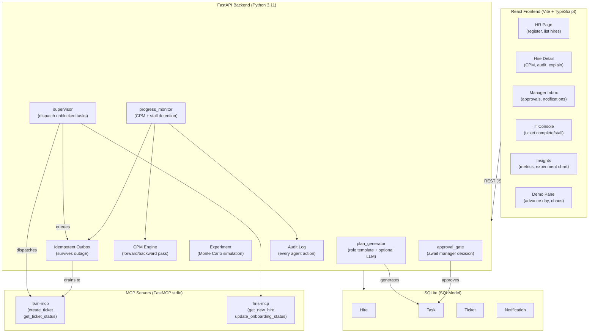
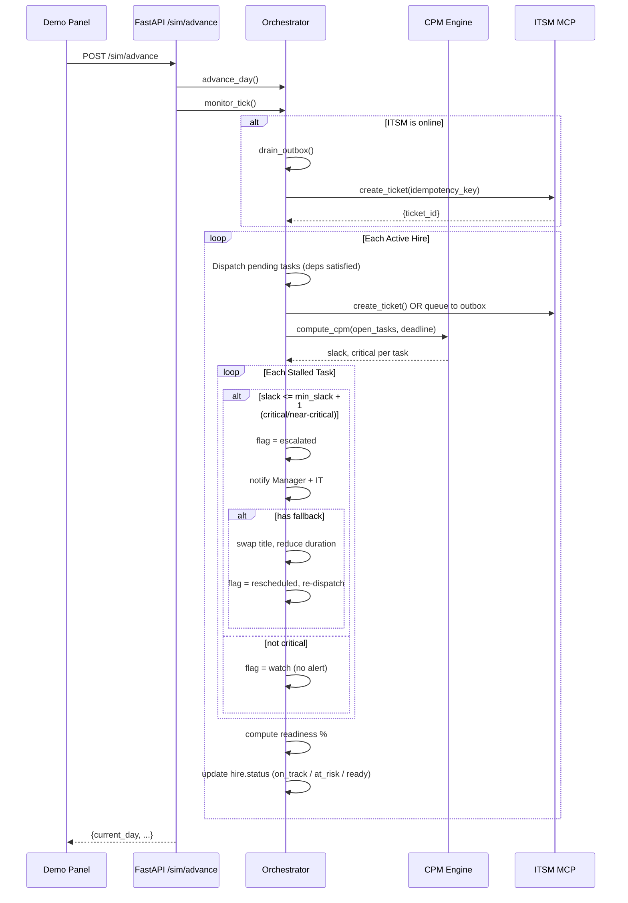
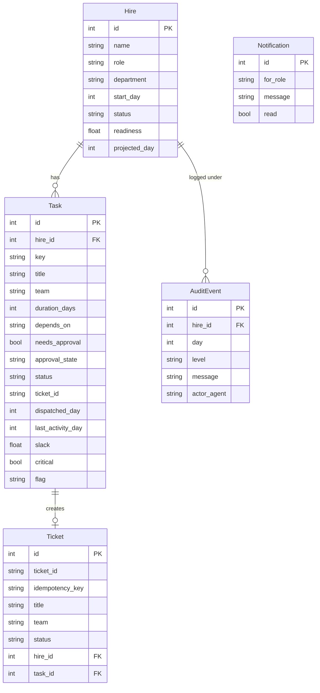
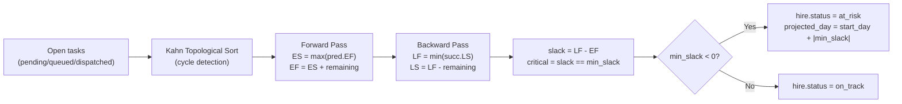

# Architecture — Cross-Team Employee Onboarding Orchestrator

## Layered View

```mermaid
graph TD
    subgraph Frontend["React Frontend (Vite + TypeScript)"]
        HR["HR Page\n(register, list hires)"]
        HD["Hire Detail\n(CPM, audit, explain)"]
        MGR["Manager Inbox\n(approvals, notifications)"]
        IT["IT Console\n(ticket complete/stall)"]
        INS["Insights\n(metrics, experiment chart)"]
        DP["Demo Panel\n(advance day, chaos)"]
    end

    subgraph Backend["FastAPI Backend (Python 3.11)"]
        PLAN["plan_generator\n(role template + optional LLM)"]
        SUPER["supervisor\n(dispatch unblocked tasks)"]
        GATE["approval_gate\n(await manager decision)"]
        MON["progress_monitor\n(CPM + stall detection)"]
        CPM["CPM Engine\n(forward/backward pass)"]
        EXP["Experiment\n(Monte Carlo simulation)"]
        OB["Idempotent Outbox\n(survives outage)"]
        AUDIT["Audit Log\n(every agent action)"]
    end

    subgraph DB["SQLite (SQLModel)"]
        HIRE["Hire"]
        TASK["Task"]
        TICKET["Ticket"]
        NOTIF["Notification"]
    end

    subgraph MCP["MCP Servers (FastMCP stdio)"]
        ITSM["itsm-mcp\n(create_ticket\nget_ticket_status)"]
        HRIS["hris-mcp\n(get_new_hire\nupdate_onboarding_status)"]
    end

    Frontend -->|REST JSON| Backend
    PLAN -->|generates| TASK
    SUPER -->|dispatches| ITSM
    SUPER -->|queues| OB
    GATE -->|approves| TASK
    MON --> CPM
    MON --> OB
    MON --> AUDIT
    Backend --> DB
    OB -->|drains to| ITSM
    SUPER --> HRIS
```

---

## Monitor Cycle (Sequence)

```mermaid
sequenceDiagram
    participant UI as Demo Panel
    participant API as FastAPI /sim/advance
    participant ORCH as Orchestrator
    participant CPM as CPM Engine
    participant ITSM as ITSM MCP

    UI->>API: POST /sim/advance
    API->>ORCH: advance_day()
    API->>ORCH: monitor_tick()

    alt ITSM is online
        ORCH->>ORCH: drain_outbox()
        ORCH->>ITSM: create_ticket(idempotency_key)
        ITSM-->>ORCH: {ticket_id}
    end

    loop Each Active Hire
        ORCH->>ORCH: Dispatch pending tasks (deps satisfied)
        ORCH->>ITSM: create_ticket() OR queue to outbox
        ORCH->>CPM: compute_cpm(open_tasks, deadline)
        CPM-->>ORCH: slack, critical per task

        loop Each Stalled Task
            alt slack <= min_slack + 1 (critical/near-critical)
                ORCH->>ORCH: flag = escalated
                ORCH->>ORCH: notify Manager + IT
                alt has fallback
                    ORCH->>ORCH: swap title, reduce duration
                    ORCH->>ORCH: flag = rescheduled, re-dispatch
                end
            else not critical
                ORCH->>ORCH: flag = watch (no alert)
            end
        end

        ORCH->>ORCH: compute readiness %
        ORCH->>ORCH: update hire.status (on_track / at_risk / ready)
    end

    API-->>UI: {current_day, ...}
```

---

## Domain Model

```mermaid
erDiagram
    Hire {
        int id PK
        string name
        string role
        string department
        int start_day
        string status
        float readiness
        int projected_day
    }
    Task {
        int id PK
        int hire_id FK
        string key
        string title
        string team
        int duration_days
        string depends_on
        bool needs_approval
        string approval_state
        string status
        string ticket_id
        int dispatched_day
        int last_activity_day
        float slack
        bool critical
        string flag
    }
    Ticket {
        int id PK
        string ticket_id
        string idempotency_key
        string title
        string team
        string status
        int hire_id FK
        int task_id FK
    }
    AuditEvent {
        int id PK
        int hire_id FK
        int day
        string level
        string message
        string actor_agent
    }
    Notification {
        int id PK
        string for_role
        string message
        bool read
    }
    Hire ||--o{ Task : "has"
    Task ||--o| Ticket : "creates"
    Hire ||--o{ AuditEvent : "logged under"
```

---

## CPM Algorithm

```mermaid
flowchart LR
    A["Open tasks\n(pending/queued/dispatched)"] --> B["Kahn Topological Sort\n(cycle detection)"]
    B --> C["Forward Pass\nES = max(pred.EF)\nEF = ES + remaining"]
    C --> D["Backward Pass\nLF = min(succ.LS)\nLS = LF - remaining"]
    D --> E["slack = LF - EF\ncritical = slack == min_slack"]
    E --> F{"min_slack < 0?"}
    F -- Yes --> G["hire.status = at_risk\nprojected_day = start_day + |min_slack|"]
    F -- No --> H["hire.status = on_track"]
```
